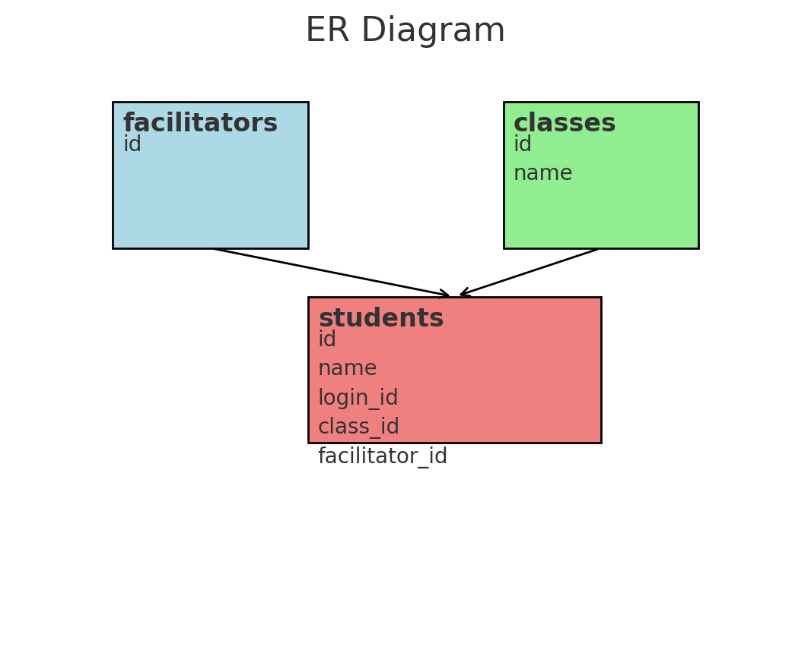

# バックエンド課題 ver.20240325

## 使い方

`docker compose` で実行する手順です。

1. `cd ./scala/pekko`
2. `sbt Docker/publishLocal`
3. `cd ../../`
4. `docker compose up -d`
5. `curl -X GET 'http://localhost:48080/students?facilitator_id=1&limit=3&page=2&sort=id&order=desc' | jq .`

```json
{
  "students": [
    {
      "classroom": {
        "id": 3,
        "name": "クラスC"
      },
      "id": 6,
      "loginId": "piyo5678",
      "name": "佐々木"
    },
    {
      "classroom": {
        "id": 1,
        "name": "クラスA"
      },
      "id": 4,
      "loginId": "hoge0000",
      "name": "加藤"
    },
    {
      "classroom": {
        "id": 3,
        "name": "クラスC"
      },
      "id": 3,
      "loginId": "baz789",
      "name": "田中"
    }
  ],
  "totalCount": 7
}

```

## 開発環境

- JDK 17以上
- sbt 1.10.x
- Docker

### ビルド

```sh
cd ./scala/pekko
sbt
```

## テーブル設計

### ER図



- `facilitators` テーブルは教師の情報を保持します。
- `classes` テーブルはクラスの情報を保持します。
- `students` テーブルは生徒の情報を保持し、各生徒は特定のクラスと教師に関連付けられます。

### 論理設計

#### facilitators テーブル

| カラム名 | データ型 | 制約       | 説明             |
|----------|----------|------------|------------------|
| id       | INT      | NOT NULL PRIMARY KEY | 教師ID          |

#### classes テーブル

| カラム名 | データ型 | 制約       | 説明             |
|----------|----------|------------|------------------|
| id       | INT      | NOT NULL PRIMARY KEY | クラスID        |
| name     | VARCHAR(50) | NOT NULL | クラス名         |

#### students テーブル

| カラム名        | データ型    | 制約                 | 説明                   |
|-----------------|-------------|----------------------|------------------------|
| id              | INT         | NOT NULL PRIMARY KEY | 生徒ID                 |
| name            | VARCHAR(50) | NOT NULL             | 生徒名                 |
| login_id        | VARCHAR(50) | NOT NULL             | ログインID            |
| class_id        | INT         | NOT NULL             | クラスID (外部キー)    |
| facilitator_id  | INT         | NOT NULL             | 教師ID (外部キー)      |

### 外部キー制約

- `students` テーブルの `class_id` は `classes` テーブルの `id` を参照
- `students` テーブルの `facilitator_id` は `facilitators` テーブルの `id` を参照

## API

[openapi.yaml](openapi.yaml)

